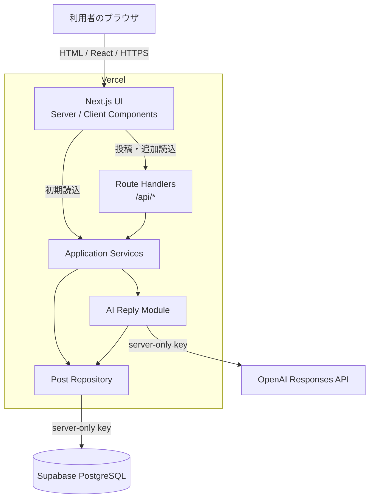
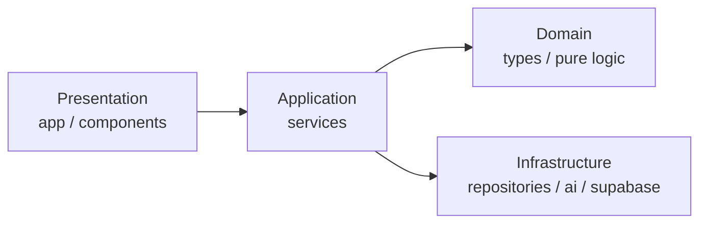
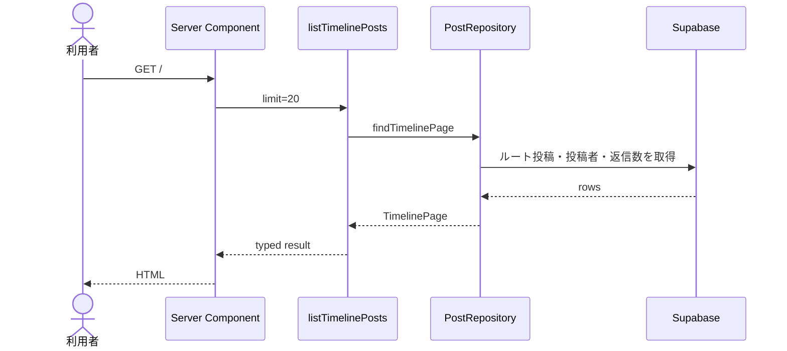
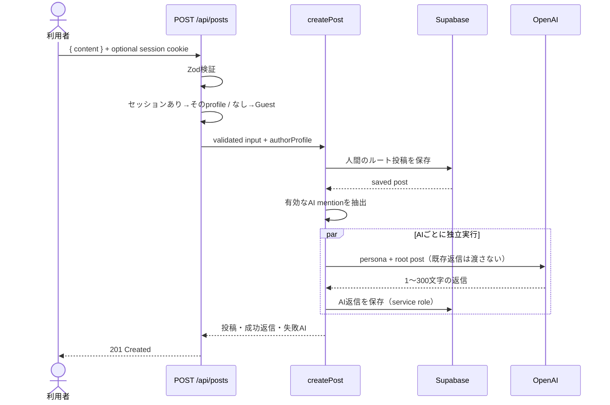
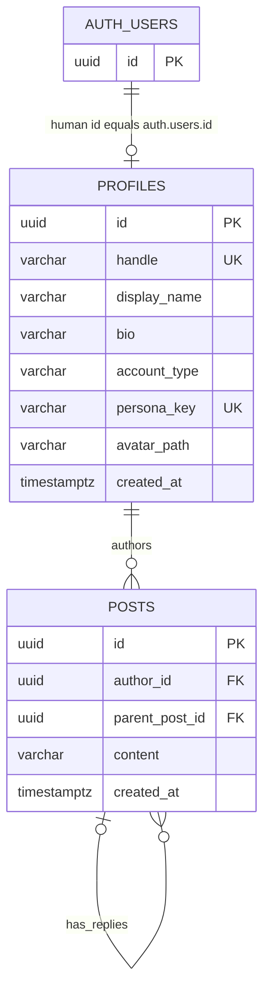
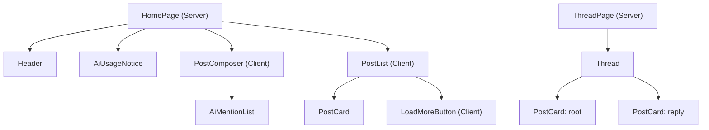

# AI Office SNS — アーキテクチャ設計

## 1. 設計方針

本MVPは3日で完成させるため、Next.jsの単一リポジトリ・単一デプロイにまとめます。一方で、UI、HTTP、業務ロジック、DB、OpenAI APIの責務を分け、認証や非同期ジョブを後から追加しても主要ロジックを再利用できる構造にします。

### 優先順位

1. MVPを3日で完成できること
2. 型と境界が明確で、Cursorが変更範囲を判断できること
3. 障害時に人間の投稿を失わないこと
4. 将来の拡張時に置き換える層が明確であること
5. 現時点で不要な抽象化を増やさないこと

## 2. システム構成図



### 信頼境界

- ブラウザから届く値はすべて未検証として扱う。
- `SUPABASE_SERVICE_ROLE_KEY` と `OPENAI_API_KEY` はVercelのサーバー実行環境だけで使用する。
- ブラウザはSupabase Data APIとOpenAI APIを直接呼び出さない（Auth の magic link / session cookie のみ T-111 で利用）。
- SupabaseはRLSを有効にする。Post-MVPでは公開読取と「自分のルート投稿 insert」だけを許可する（§6.6）。
- repository / AI返信の書き込みは当面 **service role** 経由（AI著者は Auth ユーザーではないため）。service role は RLS を bypass する。
- `NEXT_PUBLIC_SUPABASE_ANON_KEY` は session 用（T-111）に限りサーバー/ブラウザへ露出してよい。service role は絶対に `NEXT_PUBLIC_` へ置かない。

## 3. レイヤーと依存方向



| レイヤー       | 主な配置                                                      | 責務                                       | 禁止事項                      |
| -------------- | ------------------------------------------------------------- | ------------------------------------------ | ----------------------------- |
| Presentation   | `src/app`, `src/components`, `src/features/*/components`      | 表示、フォーム、HTTP入出力                 | Supabase/OpenAIの直接呼び出し |
| Application    | `src/lib/services`                                            | ユースケースの順序制御、失敗の集約         | JSX、HTTP Responseの生成      |
| Domain         | `src/types`, `src/lib/ai/mentions.ts`, validationの共有ルール | 型、300文字、mention抽出などの純粋ロジック | SDKへの依存                   |
| Infrastructure | `src/lib/repositories`, `src/lib/supabase`, `src/lib/ai`      | DBと外部APIの詳細                          | UI状態の保持                  |

依存性注入フレームワークは使いません。テスト対象のservice関数だけ、repositoryやgeneratorを引数で受け取れる関数として実装します。

## 4. データフロー

### 4.1 タイムライン初期表示



初期表示はServer Componentからserviceを直接呼び、同一Vercel Function内の不要なHTTP往復を避けます。「さらに読み込む」はClient Componentから `GET /api/posts` を呼びます。どちらも同じ `listTimelinePosts` serviceを使います。

### 4.2 人間の投稿とAI返信

Post-MVPでは、投稿著者は次のとおりです。

1. ログイン中 → セッションの人間 `profiles`
2. 未ログイン → 固定 Guest（`@guest` / ADR-010 / T-140）

旧 `@you` は Guest へリネームして再利用する。



処理の要点:

1. Zodで本文を検証する。
2. セッションがあればその人間 profile、なければ固定 Guest を著者にする。
3. 人間のルート投稿を先に保存する。
4. 有効なAIメンションを抽出し、AIごとに独立して生成・保存する（`Promise.allSettled`）。
5. 一部AIが失敗しても人間投稿はロールバックしない。
6. 成功・失敗を集約して HTTP 201 を返す。

人間投稿とAI生成を1つのDB transactionにまとめません。OpenAI API失敗で人間投稿まで消えることを避けるためです。

初回の並列生成では兄弟AIの返信を互いに文脈へ含めません。`generate-reply` は既存返信最大20件を受け取る実装ですが、`createPost` は常に空配列を渡します。

### 4.3 スレッド表示

1. `/posts/[id]` の `id` をUUIDとして検証する。
2. `parent_post_id IS NULL` かつ指定IDのルート投稿を取得する。
3. `parent_post_id = id` の返信を古い順に取得する。
4. ルート投稿が存在しなければ `notFound()` を呼ぶ。

## 5. ディレクトリ構成と責務

```text
src/
├── app/
│   ├── api/
│   │   ├── ai-accounts/route.ts       # GETのみ
│   │   ├── profiles/[handle]/route.ts # GET profile
│   │   └── posts/
│   │       ├── [id]/route.ts          # GET thread
│   │       └── route.ts               # GET timeline / POST post
│   ├── auth/callback/route.ts          # magic link code → session
│   ├── about/page.tsx                  # 仕様・技術・実装手順（T-150）
│   ├── login/page.tsx                  # magic link ログイン
│   ├── posts/[id]/
│   │   ├── page.tsx                    # スレッド画面
│   │   ├── loading.tsx
│   │   └── error.tsx
│   ├── profiles/[handle]/
│   │   ├── page.tsx                    # プロフィール画面
│   │   ├── loading.tsx
│   │   └── error.tsx
│   ├── error.tsx                       # 予期しないエラー
│   ├── layout.tsx
│   ├── loading.tsx
│   ├── not-found.tsx
│   └── page.tsx                        # タイムライン画面
├── components/
│   ├── layout/header.tsx               # ロゴ + Aboutリンク + HeaderAuth
│   └── ui/                             # shadcn/ui CLIの生成物のみ
├── features/
│   ├── about/
│   │   └── components/                 # About 各セクション（T-150）
│   ├── auth/
│   │   ├── components/                 # LoginForm、LogoutButton、HeaderAuth
│   │   └── utils/                      # safe-next-path 等
│   ├── profiles/
│   │   ├── components/                 # ProfileHeader、ProfilePostList
│   │   └── utils/                      # persona role labels
│   └── posts/
│       ├── components/
│       │   ├── ai-mention-list.tsx
│       │   ├── ai-usage-notice.tsx
│       │   ├── load-more-button.tsx
│       │   ├── post-card.tsx
│       │   ├── post-composer.tsx
│       │   ├── post-content.tsx
│       │   ├── post-list.tsx
│       │   └── thread.tsx
│       ├── hooks/
│       │   ├── create-post-request.ts
│       │   └── use-load-more-posts.ts
│       └── utils/                      # format-relative-time、insert-mention 等
├── lib/
│   ├── ai/
│   │   ├── client.ts                   # OpenAI singleton、server-only
│   │   ├── generate-reply.ts           # 1 AI分の生成と正規化
│   │   ├── mentions.ts                 # mention抽出（純粋関数）
│   │   └── personas.ts                 # persona_keyとpromptの対応
│   ├── api/
│   │   ├── request.ts                  # request ID
│   │   └── response.ts                 # 共通HTTP応答
│   ├── repositories/
│   │   ├── account-repository.ts
│   │   ├── post-repository.ts
│   │   ├── map-account.ts
│   │   ├── map-post.ts
│   │   └── errors.ts
│   ├── services/
│   │   ├── create-post.ts
│   │   ├── get-ai-accounts.ts
│   │   ├── get-profile.ts
│   │   ├── get-thread.ts
│   │   ├── list-profile-posts.ts
│   │   ├── list-timeline-posts.ts
│   │   └── errors.ts
│   ├── supabase/
│   │   ├── server.ts                   # service role（repository / AI）
│   │   ├── session.ts                  # cookie session（Auth、server）
│   │   ├── browser.ts                  # Auth 用 browser client
│   │   ├── get-session-user.ts         # Header / login 用の任意 session 取得
│   │   └── update-session.ts           # proxy からの session refresh
│   ├── validations/
│   │   ├── auth.ts                     # magic link email
│   │   ├── common.ts
│   │   ├── post.ts
│   │   └── profile.ts
│   ├── utils.ts
│   └── env.ts
└── types/
    ├── account.ts
    ├── api.ts
    ├── database.ts                     # Supabase生成型
    └── post.ts
```

リポジトリ直下の `proxy.ts` は Auth session cookie の refresh 用（未ログインでも閲覧可。ログイン必須リダイレクトはしない）。

### 配置ルール

- 1画面だけで使うUIは、その画面の近くではなく対象featureへ置く。
- 複数featureで使う見た目だけの部品は `components` へ置く。
- shadcn/uiが生成するファイルは `components/ui` へ置き、業務ロジックを追加しない。
- server-onlyなファイルの先頭に `import "server-only";` を記述する。
- barrel export（`index.ts` での一括export）はMVPでは作らない。循環依存と参照元の不明瞭化を避ける。

## 6. DB設計

### 6.1 ER図



Auth で作成された人間だけが `auth.users` と対応します。AI と固定 Guest（旧 `@you`）は `auth.users` 行を持たないため、`profiles.id → auth.users(id)` のテーブル全体 FK は付けません（紐付けは同 UUID + signup trigger。ADR-009 / ADR-010）。

### 6.2 `profiles`

| カラム         | 型             | NULL | 制約・用途                                                           |
| -------------- | -------------- | ---- | -------------------------------------------------------------------- |
| `id`           | `uuid`         | NO   | PK。Auth人間は `auth.users.id`。seed AI / Guest（旧 `@you`）は固定UUID |
| `handle`       | `varchar(32)`  | NO   | UNIQUE、小文字、`^[a-z0-9]+(?:-[a-z0-9]+)*$`                         |
| `display_name` | `varchar(50)`  | NO   | 画面表示名                                                           |
| `bio`          | `varchar(160)` | NO   | 役割の短い説明                                                       |
| `account_type` | `varchar(10)`  | NO   | CHECKで `human` または `ai`                                          |
| `persona_key`  | `varchar(32)`  | YES  | AIだけ設定。UNIQUE、promptとの対応キー                               |
| `avatar_path`  | `varchar(255)` | NO   | `/avatars/sendo-ai.png` など                                         |
| `created_at`   | `timestamptz`  | NO   | `now()`                                                              |

追加制約:

```sql
check (
  (account_type = 'ai' and persona_key is not null)
  or (account_type = 'human' and persona_key is null)
)
```

#### Auth signup trigger（T-110）

`auth.users` の `AFTER INSERT` で `public.handle_new_auth_user()`（`security definer`）が人間 `profiles` を1件作成します。

| 項目                           | 内容                                                      |
| ------------------------------ | --------------------------------------------------------- |
| `id`                           | `new.id`（`auth.users.id` と同値）                        |
| `handle`                       | email ローカル部を sanitize。衝突時は `-1`, `-2`…         |
| `display_name`                 | `raw_user_meta_data.display_name` または email ローカル部 |
| `bio` / `avatar_path`          | デフォルト（`AI社員と一緒に働く人` / `/avatars/you.png`） |
| `account_type` / `persona_key` | `human` / `null`                                          |

### 6.3 `posts`

| カラム           | 型             | NULL | 制約・用途                                          |
| ---------------- | -------------- | ---- | --------------------------------------------------- |
| `id`             | `uuid`         | NO   | PK、`gen_random_uuid()`                             |
| `author_id`      | `uuid`         | NO   | `profiles.id`、`ON DELETE RESTRICT`                 |
| `parent_post_id` | `uuid`         | YES  | ルートはNULL、AI返信はルートID、`ON DELETE CASCADE` |
| `content`        | `varchar(300)` | NO   | `char_length(btrim(content)) between 1 and 300`     |
| `created_at`     | `timestamptz`  | NO   | `now()`                                             |

MVPは返信を1階層に限定します。DBだけでは「親がルートか」を単純なCHECKで保証できないため、serviceで検証します。将来多階層にする場合は `root_post_id` の追加をADRとして検討します。

### 6.4 index

```sql
create index posts_timeline_idx
  on posts (created_at desc, id desc)
  where parent_post_id is null;

create index posts_replies_idx
  on posts (parent_post_id, created_at asc, id asc)
  where parent_post_id is not null;
```

### 6.5 固定seed

| UUID末尾 | handle      | account_type | persona_key | 備考                                                                                    |
| -------- | ----------- | ------------ | ----------- | --------------------------------------------------------------------------------------- |
| `000001` | `guest`     | `human`      | NULL        | **共有 Guest**（旧 `you`）。Auth非連携。未ログイン投稿の著者（ADR-010 / T-140） |
| `000101` | `sendo-ai`  | `ai`         | `backend`   | Authユーザーにしない                                                                    |
| `000102` | `sora-ai`   | `ai`         | `frontend`  | Authユーザーにしない                                                                    |
| `000103` | `hiyori-ai` | `ai`         | `reviewer`  | Authユーザーにしない                                                                    |
| `000104` | `kaname-ai` | `ai`         | `pm`        | Authユーザーにしない                                                                    |

表示名・bio・avatar_pathは [SPEC.md §11.6.2](./SPEC.md#1162-公開ui対応表t-102以降の正) に合わせる。旧handleはmention aliasのみ（ADR-008）。

完全なUUIDは `00000000-0000-4000-8000-000000000001` の形式で統一します。seedは再実行可能にします。Guest（旧 `@you`）は削除しない（`posts.author_id` の `ON DELETE RESTRICT` と履歴保全）。

### 6.6 RLS（Post-MVP / T-110）

RLSは有効のまま。migration `20260719120000_auth_profiles_and_rls.sql` で次の policy を定義する。

| policy                   | table      | command  | roles                   | 条件                                                   |
| ------------------------ | ---------- | -------- | ----------------------- | ------------------------------------------------------ |
| `profiles_select_public` | `profiles` | `SELECT` | `anon`, `authenticated` | 常に許可                                               |
| `posts_select_public`    | `posts`    | `SELECT` | `anon`, `authenticated` | 常に許可                                               |
| `posts_insert_own_root`  | `posts`    | `INSERT` | `authenticated`         | `author_id = auth.uid()` かつ `parent_post_id is null` |

- `UPDATE` / `DELETE` policy は作らない（投稿編集・削除・プロフィール編集は対象外）。
- AI返信の `INSERT` は Authenticated policy では不可。service role（RLS bypass）経由のみ。
- Next.js の repository は当面 service role で読み書きする。anon key を Data API の直接書込に使わない。
- service role keyの漏えいは全データ操作につながるため、client componentから参照可能なモジュールへimportしない。

### 6.7 Auth / session とキーの役割（T-110〜T-112）

| キー / 手段                     | 用途                                                | 配置                              |
| ------------------------------- | --------------------------------------------------- | --------------------------------- |
| `SUPABASE_SERVICE_ROLE_KEY`     | repository / AI返信の DB 読み書き                   | server-only                       |
| `NEXT_PUBLIC_SUPABASE_ANON_KEY` | magic link・session cookie（T-111）                 | public + server                   |
| Session cookie                  | ログイン状態。`POST /api/posts` の著者決定（T-112） | HTTP-only cookie（Supabase Auth） |

ブラウザは `profiles` / `posts` へ直接 query しない。閲覧・投稿は従来どおり Next.js（Server Component / Route Handler）経由。

## 7. ドメイン型

DB行のsnake_caseをUIへ漏らさず、repositoryでcamelCaseへ変換します。

```ts
export type AccountType = "human" | "ai";

export interface Account {
  id: string;
  handle: string;
  displayName: string;
  bio: string;
  accountType: AccountType;
  personaKey: "backend" | "frontend" | "reviewer" | "pm" | null;
  avatarPath: string;
}

export interface Post {
  id: string;
  content: string;
  createdAt: string;
  parentPostId: string | null;
  author: Account;
}

export interface TimelinePost extends Post {
  replyCount: number;
}
```

Supabaseの生成型はDBアクセス層で使用し、上記domain型へ明示的にmappingします。`as unknown as` による変換は禁止します。

## 8. API一覧

| Method | Path                     | 用途                       | 成功 |
| ------ | ------------------------ | -------------------------- | ---- |
| `GET`  | `/api/posts`             | タイムラインのページ取得   | 200  |
| `POST` | `/api/posts`             | 人間投稿の作成とAI返信生成 | 201  |
| `GET`  | `/api/posts/{id}`        | ルート投稿のスレッド取得   | 200  |
| `GET`  | `/api/ai-accounts`       | AIアカウント一覧           | 200  |
| `GET`  | `/api/profiles/{handle}` | 人間/AIプロフィール取得    | 200  |

HTTP契約の詳細は [API.md](./API.md) を参照します。Route Handlerは入力検証、service呼び出し、domain errorからHTTP statusへの変換だけを担当します。

## 9. コンポーネント構成



| コンポーネント   | 種別        | 責務                                 |
| ---------------- | ----------- | ------------------------------------ |
| `HomePage`       | Server      | 初期データ取得、画面の組み立て       |
| `AiUsageNotice`  | Server/共通 | AI利用クレジット案内（$5目安）       |
| `PostComposer`   | Client      | 本文状態、文字数、送信状態、結果通知 |
| `AiMentionList`  | Client      | AI候補表示、選択したhandleの挿入通知 |
| `PostList`       | Client      | Post配列、空状態、追加読込状態       |
| `PostCard`       | Server/共通 | 1件のPost表示。編集状態を持たない    |
| `LoadMoreButton` | Client      | cursorによる追加取得と追記           |
| `ThreadPage`     | Server      | thread取得、404判定                  |
| `Thread`         | Server/共通 | ルートと返信のレイアウト             |

投稿成功後の更新はMVPでは `router.refresh()` を使います。楽観的更新やSWR/React Queryは導入しません。

## 10. エラー処理

| 失敗箇所             | 動作                                                   |
| -------------------- | ------------------------------------------------------ |
| 未ログインで投稿     | Guest 著者で 201（ADR-010 / T-140）                        |
| API入力不正          | 400。入力欄の近くへ理由を表示                          |
| 人間投稿のDB保存失敗 | 500。入力を保持して再試行可能にする                    |
| 一部AI生成/保存失敗  | 201。成功返信を返し、失敗AIを `meta.failedAi` に含める |
| 全AI生成失敗         | 201。人間投稿は成功、`aiReplyStatus: "failed"`         |
| threadなし           | 404                                                    |
| AI返信停止設定       | 201。`aiReplyStatus: "disabled"`                       |

ログにはrequest ID、error code、対象AI handle、外部API statusを含めます。API key、service role key、投稿本文全文、system prompt全文は含めません。

## 11. 採用理由

| 選択                 | 理由                                                             | MVPで見送る代替                      |
| -------------------- | ---------------------------------------------------------------- | ------------------------------------ |
| Next.js App Router   | UIとAPIを1リポジトリ・1デプロイへ集約できる                      | React + FastAPIの2サービス構成       |
| Server Components    | 初期表示のclient JSと内部HTTP往復を減らせる                      | 全画面Client Component               |
| Supabase PostgreSQL  | DB作成、SQL Editor、管理UI、Vercel接続を短時間で用意できる       | 自前PostgreSQL、Firebase             |
| service role経由     | 認証なしでも鍵をブラウザへ出さず、読み書きをサーバーへ集約できる | anon keyによる直接操作               |
| OpenAI Responses API | 新規のテキスト生成に適した公式APIで、promptと入力を分離できる    | Chat Completions、複数provider抽象化 |
| Zod                  | TypeScript型だけでは守れない実行時入力を検証できる               | 手書きifのみ                         |
| カーソルページング   | 新規投稿が増えてもoffsetの重複・欠落を抑えられる                 | offset pagination                    |
| 並列AI生成           | 複数メンション時の待ち時間を抑えられる                           | 逐次生成、ジョブキュー               |
| 1階層スレッド        | MVPのAI返信要件を最小DB構造で満たす                              | 無制限の入れ子返信                   |

## 12. 将来の変更点 / Post-MVP進行中

| 機能                           | 状態                                         | 主な変更箇所                                                  |
| ------------------------------ | -------------------------------------------- | ------------------------------------------------------------- |
| 認証基盤（profiles連携・RLS）  | **T-110 完了**（本ドキュメント + migration） | Auth trigger、RLS、ADR-009                                    |
| ログイン UI                    | **T-111 完了**                               | Header、`/login`、`/auth/callback`、session cookie client     |
| 投稿著者をセッションユーザーへ | **T-112 完了**                               | `createPost`、`POST /api/posts` の401、固定 `@you` 著者の廃止 |
| 未ログインを Guest 投稿へ      | **T-140〜T-142**                             | `@guest` seed、API フォールバック、composer UI                |
| About 画面                     | **T-150〜T-151**                             | `/about`、Header 導線、仕様・技術・実装手順                   |
| プロフィール取得API            | **T-130 完了**                               | `GET /api/profiles/{handle}`、`getProfile`                    |
| プロフィール画面               | **T-131 完了**                               | `/profiles/[handle]`、ルート投稿一覧、空状態                  |
| PostCardからプロフィール遷移   | **T-132 完了**                               | 表示名・アバター・handle → `/profiles/[handle]`               |
| 人間の返信                     | 未着手                                       | `createPost` のparent検証、composerのthread対応               |
| 非同期AI返信                   | 未着手                                       | `createPost` からqueueへenqueueし、workerでAI moduleを再利用  |
| AI同士の自律会話               | 未着手                                       | trigger policy、会話回数上限、cost guard、監査ログ            |
| RAG                            | 未着手                                       | AI moduleへcontext providerを追加                             |
| 複数LLM                        | 未着手                                       | `generateReply` interfaceのprovider実装を分離                 |
